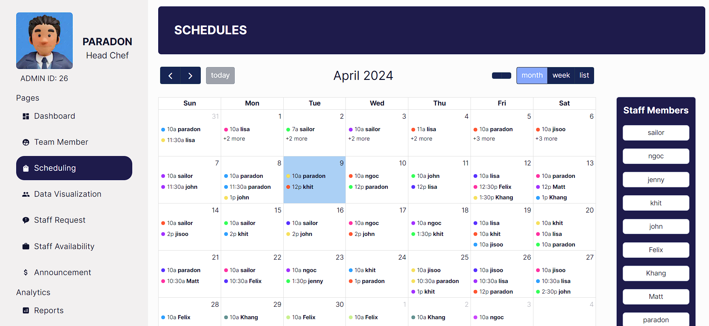

# SchedulesRUs

Schedule"R"Us is Sheduling Management System for restaurant to especially organize the shift and schedule of employees in the restaurant.

This Scheduling Management System is envisioned as a comprehensive tool that not only simplifies the intricate task of staff scheduling but also integrates seamlessly with other vital aspects of restaurant management.

# 1.FullCalendar

FullCalendar is a JavaScript library for creating interactive calendars on websites. It provides a flexible and customizable way to display events, schedules, and other date-related information. FullCalendar is often used in web development projects where a dynamic and feature-rich calendar interface is required.

## Installation

Install the React connector, the core package, and any plugins (like daygrid):

npm i @fullcalendar/react @fullcalendar/core @fullcalendar/daygrid @fullcalendar/interaction @fullcalendar/timegrid @fullcalendar/list

## Documentation

Check out the [FullCalendar Documentation](https://fullcalendar.io/docs) for more details and advanced usage.

# 2.Nivo

Nivo is a well-known library for building data visualizations in React applications. It offers a rich set of graph components, including standard charts like bar, line, pie, scatter, and more complex visualizations like heatmaps, radar charts, and network diagrams. Nivo is built on top of D3.js, which is a powerful and flexible tool for creating complex data visualizations in the browser, but Nivo simplifies the process by providing pre-built, customizable components that are easy to integrate into React applications.

## Installation

Please install the below packgage:
   
npm i @nivo/line @nivo/bar @nivo/pie @nivo/calendar

## Documentation

The Nivo documentation is hosted on its official website, which you can visit at https://nivo.rocks. This site provides an overview of all the available charts and features.

# 3.Headless UI

Headless UI is a library of completely unstyled, fully accessible UI components, designed to integrate seamlessly with Tailwind CSS. It's developed by the creators of Tailwind CSS to provide developers with the core functionality of various UI components without any default styling. This approach allows developers to build their own unique UI designs on top of robust, accessible components without having to fight against pre-existing styles.

## Installation

npm install @headlessui/react

## Documentation

For full documentation, please visit[headlessui.com](https://headlessui.com)

# 4.@react-native-community/datetimepicker
The @react-native-community/datetimepicker is a React Native library that provides date and time picker components for iOS and Android platforms. It offers a simple and efficient way to incorporate native date and time selection functionality in your React Native applications. With this library, developers can easily implement user interfaces that require date or time input without the need for custom-built solutions or third-party plugins.

## Installation
To add the DateTimePicker to your React Native project, run the following command:
npm install @react-native-community/datetimepicker --save

or if you using Yarn:
yarn add @react-native-community/datetimepicker

## Documentation
Detailed documentation and usage instructions for the @react-native-community/datetimepicker can be found on the GitHub repository: https://github.com/react-native-datetimepicker/datetimepicker. The repository includes information on installation, API reference, and examples for both iOS and Android.
